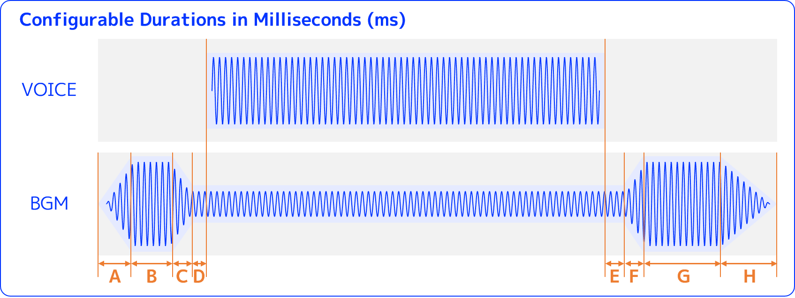

# 📦 Simple Audio Mixer - Small tools to enrich your podcast with background music

- **Plugin ID** : kurokobo/simple_audio_mixer
- **Author** : kurokobo
- **Type** : tool
- **Repository** : <https://github.com/kurokobo/dify-plugin-collection>
- **Marketplace** : <https://marketplace.dify.ai/plugins/kurokobo/simple_audio_mixer>

## ✨ Overview

Small tools to enrich your podcast with background music:

- ✅ **Simple BGM Mixer**
  - Mixes a voice file with a background music file for podcast audio.
- ✅ **Simple Stereo Mixer**
  - Mixes up to five audio files into a single stereo audio file.

## 🛠️ Bundled Tools

### ✅ Simple BGM Mixer

This is a tool to mix a voice file with a background music (BGM) file.

By this tool, you can make your podcast even more attractive by adding your favorite BGM to the audio generated by [the Podcast Generator](https://marketplace.dify.ai/plugins/langgenius/podcast_generator).

#### ✨ Key Features

- ✨ The BGM will automatically loop to match the length of the voice (plus intro and outro).
- ✨ If the BGM is long, it will be cut to fit with the voice content.
- ✨ You can also finely adjust the durations and volume ratios of the intro and outro sections of the BGM before and after the voice, as well as the duration of the fade-in and fade-out.
- ✨ Outputs the mixed audio file in `mp3` (160 kbps) or `wav` format in 44.1 kHz sample rate.

#### 🎚️ Parameters

At a minimum, please specify an audio file, a BGM file, and output format.

- **Voice File** (`voice_file`)
  - The voice file to be mixed with the BGM.
  - You can use [the Podcast Generator](https://marketplace.dify.ai/plugins/langgenius/podcast_generator) to generate the voice file.
- **BGM File** (`bgm_file`)
  - The background music file to be mixed with the voice file.
- **Output Format** (`output_format`)
  - The output format of the mixed audio file.
  - Supported formats are `mp3` (160 kbps), `wav`.

I recommend running it once with the default values for all other parameters first.

If you want to fine-tune them, please refer to the diagram below.

The **Duration** is in milliseconds (ms). Configurable durations are as follows:

- **A**) BGM Intro Fade-in Duration (ms) (`a_bgm_intro_fadein_ms`), defaults to `100`
- **B**) BGM Intro Play Duration (ms) (`b_bgm_intro_play_ms`), defaults to `5000`
- **C**) BGM Intro Fade-out Duration (ms) (`c_bgm_intro_fadeout_ms`), defaults to `1000`
- **D**) BGM Pre-Voice Delay Duration (ms) (`d_bgm_pre_voice_delay_ms`), defaults to `500`
- **E**) BGM Post-Voice Delay Duration (ms) (`e_bgm_post_voice_delay_ms`), defaults to `1000`
- **F**) BGM Outro Fade-in Duration (ms) (`f_bgm_outro_fadein_ms`), defaults to `1000`
- **G**) BGM Outro Play Duration (ms) (`g_bgm_outro_play_ms`), defaults to `5000`
- **H**) BGM Outro Fade-out Duration (ms) (`h_bgm_outro_fadeout_ms`), defaults to `5000`

The **Volume Ratio** refers to the proportion of the volume of the original audio file, with `1.0` representing 100%. For example, `0.0` means 0%, `1.0` means 100%, and `2.0` means 200%.

- **I**) Voice Volume Ratio (`i_voice_volume_ratio`), defaults to `1.0`
- **J**) BGM Intro Volume Ratio (`j_bgm_intro_volume_ratio`), defaults to `1.0`
- **K**) BGM During Voice Volume Ratio (`k_bgm_during_voice_volume_ratio`), defaults to `0.2`
- **L**) BGM Outro Volume Ratio (`l_bgm_outro_volume_ratio`), defaults to `1.0`
- **Z**) Master Volume Ratio (`z_master_volume_ratio`), defaults to `1.0`

### ✅ Simple Stereo Mixer

This is a tool to mix up to five audio files into a single stereo audio file.

#### ✨ Key Features

- ✨ Up to five audio files can be mixed.
- ✨ Configurable panning for each audio file.
- ✨ Configurable volume ratios for each audio file.
- ✨ Outputs the mixed audio file in `mp3` (160 kbps) or `wav` format in 44.1 kHz sample rate.
- ✨ You can also use this to adjust the panning and volume of a single audio file.

#### 🎚️ Parameters

At a minimum, please specify an audio file.

- **Audio File 1** (`audio_file_1`) through **Audio File 5** (`audio_file_5`)
  - The audio files to be mixed.
- **Panning for Each Audio File** (`pannings`)
  - A colon-separated list of panning values for each audio file.
  - `-1.0` is 100% left, `0.0` is center, and `1.0` is 100% right.
  - Example: `-0.8:0.0:0.8` for three audio files, the first one panned to the left, the second one centered, and the third one panned to the right.
- **Volume Ratios for Each Audio File** (`volume_ratios`)
  - A colon-separated list of volume ratios for each audio file.
  - The volume ratio refers to the proportion of the volume of the original audio file, with `1.0` representing 100%. For example, `0.0` means 0%, `1.0` means 100%, and `2.0` means 200%.
  - Example: `1.0:0.5:2.0` for three audio files, the first one at 100% volume, the second one at 50% volume, and the third one at 200% volume.
- **Output Format** (`output_format`)
  - The output format of the mixed audio file.
  - Supported formats are `mp3` (160 kbps), `wav`.

## 🕙 Changelog

See the [CHANGELOG.md](https://github.com/kurokobo/dify-plugin-collection/blob/main/tools/simple_audio_mixer/CHANGELOG.md) on GitHub for the latest updates and changes to this plugin.

## 📜 Privacy Policy

See the [PRIVACY.md](https://github.com/kurokobo/dify-plugin-collection/blob/main/tools/simple_audio_mixer/PRIVACY.md) on GitHub for details on how we handle user data and privacy.

## ℹ️ Contact Us

If you have any questions, suggestions, or issues regarding this plugin, please feel free to reach out to us through the following channels:

- [Open an issue on GitHub](https://github.com/kurokobo/dify-plugin-collection/issues)
- [Mention @kurokobo on GitHub](https://github.com/kurokobo)
- [Mention @kurokobo on the official Dify Discord serverl](https://discord.com/invite/FngNHpbcY7)

## 🔗 Related Links

- **Icon**: [Heroicons](https://heroicons.com/)
